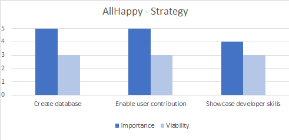
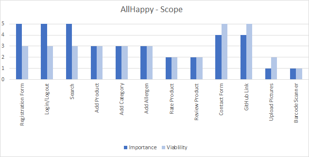
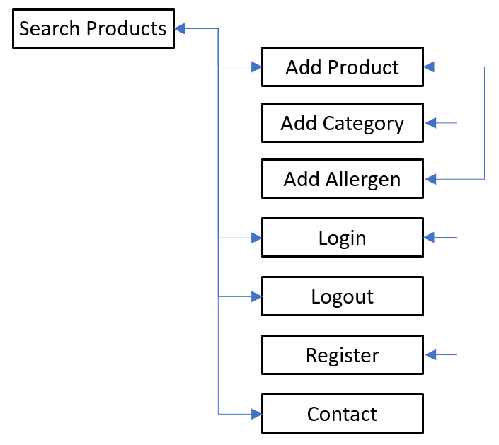

# FreeFrom #
[FreeFrom Live Site](https://richardhenyash.github.io/freefrom/)  

## Contents ##
- [Background](#background)
- [Project Goals](#project-goals)
- [Site Owner Goals](#site-owner-goals)
- [User Goals](#user-goals)
- [UX](#ux)
    - [Project Strategy](#project-strategy)
        - [Opportunities Matrix](#opportunities-matrix)
    - [Project Scope](#project-scope)
        - [User Demographics](#user-demographics)
        - [User Requirements](#user-requirements)
        - [User Stories](#user-stories)
        - [Contraints](#constraints)
        - [Functional Requirements](#functional-requirements)
        - [Business Rules](#business-rules)
        - [Key Features](#key-features)
    - [Site Map](#site-map)
    - [Wireframes](#wireframes)
    - [Design Choices](#design-choices)
        - [Fonts](#fonts)
        - [Colours](#colours)
- [Technologies](#technologies)
    - [Languages](#languages)
    - [Frameworks Libraries and Tools](#frameworks-libraries-and-tools)
    - [Browser Support](#browser-support)
- [Structure](#structure)
    - [Information Architecture](#information-architecture)
    - [Features Implemented](#features-implemented)
        - [Features Implemented in Phase 1](#features-implemented-in-phase-1)
        - [Features To Be Implemented In Future Development Phases](#features-to-be-implemented-in-future-development-phases)
        - [Design Changes During The Phase 1 Development](#design-changes-during-the-phase-1-development)
    - [Responsive Styling](#responsive-styling)
- [Testing](#testing)
- [Deployment](#deployment)
- [Credits](#credits)
- [Acknowledgements](#acknowledgements)

## Background ##
EU law mandates that 14 major food allergens are listed in food product ingredients.
It is currently quite difficult when shopping to identify products which are suitable for different allergies and intolerances - 
generally requiring the consumer to read the ingredients on individual product packaging, which can be quite time consuming.
Additionally, since the COVID-19 pandemic, consumers are less comfortable picking up products in a supermarket, reading the ingredients
and then putting the product back on the shelf.

## Project Goals ##
To provide an online, open source, interactive information resource that enables consumers to identify 
products which are free from common allergens, and therefore suitable for food allergies and intolerances. 
The site could also be expanded in the future to include products suitable for vegans, products which are 
free from palm oil, and products which are ethically sourced.

## Site Owner Goals ##
Developing the site will serve as a learning experience for the developer. The finished website will act as a showcase for the
developer's skills and will also help to raise the developer's profile. If the site becomes very popular, it may be
possible to generate advertising revenue in the future.

## User Goals ##
To find products which are free from allergens and therefore suitable for food intolerances and allergies, 
and to add intolerance and allergy safe food products to the information resource.

## UX ##

### Project Strategy ###

#### Opportunities Matrix ####
The following opportunities were identified and ranked using a score of 1 - 5 for importance and viability:

Opportunity|Description|Importance|Viability|Opportunity ID
-----------|-----------|----------|---------|--------------
Create database| Create an online, searchable database that enables consumers to identify products which are suitable for food allergies and intolerances|5|3|Op-1
Enable User contribution|Enable users to contribute to the database|5|3|Op-2
Showcase developer's skills|The site will serve as a showcase for the developer's skills, and increase the developer's standing within the tech community|4|3|Op-3

### Project Scope ###
#### User Demographics ####
* The primary users of the site will be consumers with food allergies and intolerances, 
and consumers with children or relatives who have food allergies and intolerances.
* A simple, well layed out site with the key information being easy to find and easy 
to contribute to would suit this demographic.

#### User Requirements ####
* Simple and well layed out.
* Easy to find key information.
* Easy to contribute to.
* Responsive design is required as users may be viewing the site on Mobile, Tablet or Desktop.

#### User Stories ####
* ***As a User, I am searching for a product which is free from one or more allergens.***
* ***As a User, I have found a product which is free from one or more allergens, and I want to add it to the database.***
* ***As a User, I have tried a product and would like to rate it.***
* ***As a User, I have tried a product and would like to review it.***
* ***As a User, I would like to add a new product category.***
* ***As a User, I would like to add a new allergen.***
* ***As a User, I would like to be able to contact the developer.***

#### Constraints #####
* Developer skill set - the Developer is currently learning Python, Flask and MongoDB. 
This may impact on which features can be succesfully implemented during the phase 1 development.
* Developer's available time - the developer is working full time whilst studying.
This coupled with the developer's current skills constraints may impact which features 
can be succesfully implemented during the phase 1 development.

#### Functional Requirements ####
* The User needs to be able to register.
* The User needs to be able to login and logout.
* The User needs to be able to search for products which are free from one or more allergens.
* The User needs to be able to add products.
* The User needs to be able to rate products.
* The User needs to be able to review products.
* The User needs to be able to edit products.
* The User needs to be able to delete products (this should be restricted to users with the correct privelages).
* The User needs to be able to add product categories (this should be restricted to users with the correct privelages).
* The User needs to be able to edit product categories (this should be restricted to users with the correct privelages).
* The User needs to be able to delete product categories (this should be restricted to users with the correct privelages).
* The User needs to be able to add allergens (this should be restricted to users with the correct privelages).
* The User needs to be able to edit allergens (this should be restricted to users with the correct privelages).
* The User needs to be able to delete allergens (this should be restricted to users with the correct privelages).
* The User needs to be able to contact the developer.

#### Business Rules ####
* It is not envisaged that the site will generate profits. It is intended to be used as an independent source of 
information for consumers. If the site becomes very popular, it may be possible to generate advertising revenue in the future.

#### Key Features ####
The following key features have been identified and scored from 1 - 5 for importance and viability. 
Each feature is mapped back to the [Opportunities Matrix](#opportunities-matrix). 
The proposed development phase has also been indicated:

Feature|Description|Importance|Viability|Opportunity ID|Development Phase
-------|-----------|----------|---------|--------------|-----------------
Registration Form|User registration form|5|3|Op-2|1
Login/Logout|User login/logout form|5|3|Op-2|1
Search|Enables users to search the database based on one or more allergies or intolerances|5|3|Op-1|1
Add Product|Enables users to add a product to the database|3|3|Op-2|1
Add Category|Enables users with required privelages to add product categories to the database|3|3|Op-1, Op-2|1
Add Allergen|Enables users with the required privelages to add allergen types to the database|3|3|Op-1, Op-2|1
Rate Product|Enables users to give a star rating to a product|2|2|Op-2|1
Review Product|Enables users to review a product|2|2|Op-2|1
Contact Form|Form to contact developer|4|5|Op-3|1
GitHub Link|Link to developer github page|4|5|Op-3|1
Upload Pictures|Enables users to add pictures of products and ingredients|1|2|Op-2|2
Barcode Scanner|Enables users to automatically add products by scanning a product barcode with their device camera|1|1|Op-2|2

### Site Map ###
An initial [Site Map](./assets/wireframes/site-map.png) was produced, and is shown below:  

### Wireframes ###
[Hand Sketches](/assets/wireframes/rev0)  
[Initial Wireframes](/assets/wireframes/rev1) 
[Responsive design wireframes](/assets/wireframes/rev2) 

### Design Choices ###

#### Fonts ####

#### Colours ####

## Technologies ##
### Languages ###
* [HTML](https://developer.mozilla.org/en-US/docs/Web/HTML)
* [CSS](https://www.w3.org/Style/CSS/Overview.en.html)
* [JavaScript](https://developer.mozilla.org/en-US/docs/Web/JavaScript)

### Frameworks Libraries and Tools ###
* [Bootstrap](https://getbootstrap.com/docs/4.5/getting-started/introduction/)
* [jQuery](https://jquery.com/)
* [Font Awesome](https://fontawesome.com/)
* [Google Fonts](https://fonts.google.com/)
* [Email JS](https://www.emailjs.com/)
* [Jasmine](https://jasmine.github.io/)

### Browser Support ###
The following browsers are all supported by **FreeFrom**.
* [Google Chrome](https://www.google.com/intl/en_uk/chrome/)
* [Microsoft Edge](https://www.microsoft.com/en-us/edge)
* [Safari](https://www.apple.com/uk/safari/)
* [Firefox](https://www.mozilla.org/en-GB/firefox/new/)
* [Opera](https://www.opera.com/)

For further information please see  the **Browser Compatibility** section in [TESTING.md](TESTING.md).  

## Structure ##

### Information Architecture ###

### Features Implemented ###

#### Features Implemented in Phase 1 ####

#### Features To Be Implemented In Future Development Phases ####

#### Design Changes During The Phase 1 Development ####
After initial early user testing and feedback, the following minor design changes were made:

### Responsive Styling ###

See **Responsive Design** section in [TESTING.md](TESTING.md) for further information and [Responsive Testing](./assets/testing/responsive) screen prints.

## Testing ##

Further testing information and screen prints can be found in [TESTING.md](TESTING.md).

## Deployment ##

## Credits ##

Many thanks to the following:

## Acknowledgements ##

Many thanks to the following for help and inspiration during this project:

